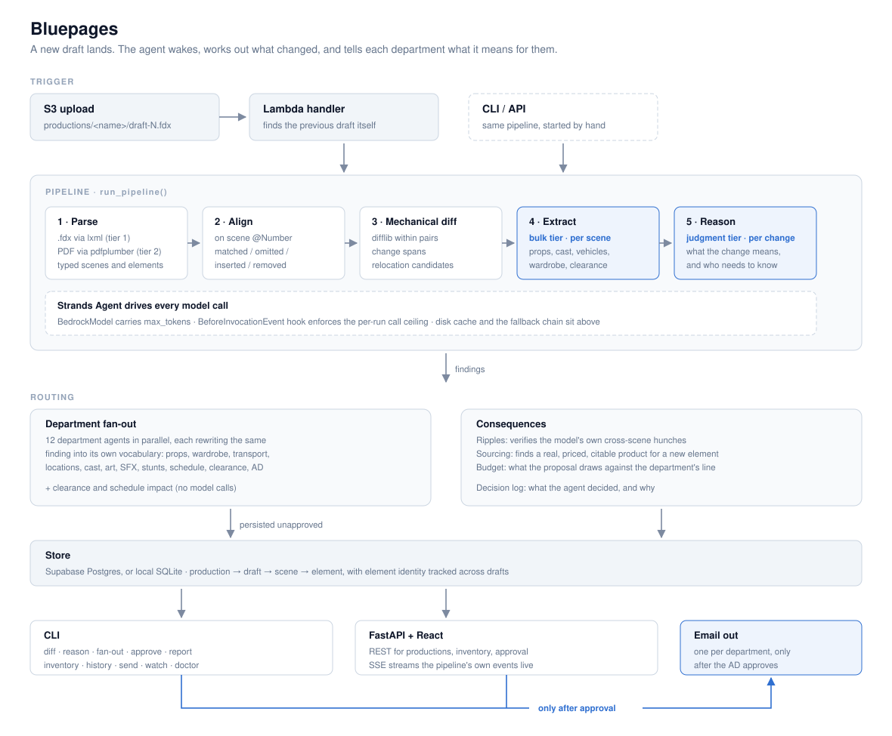
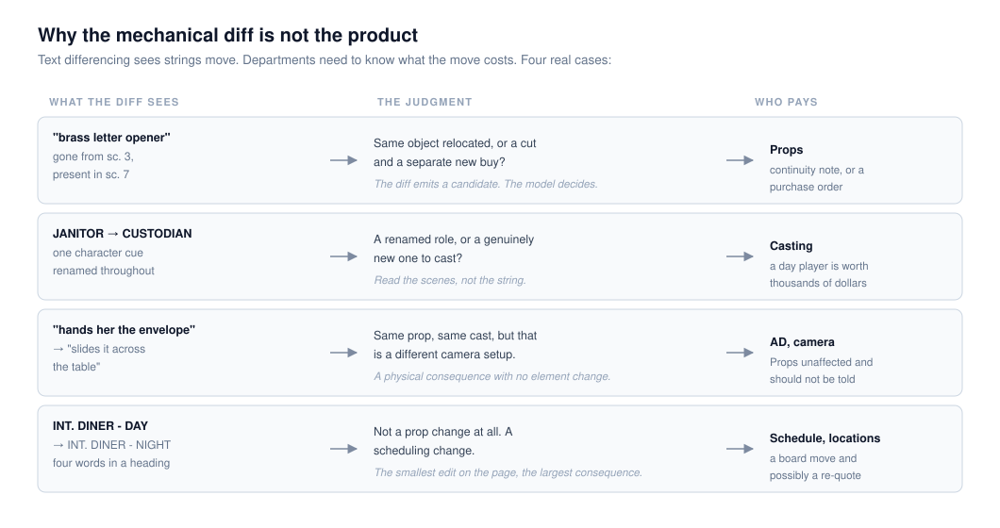
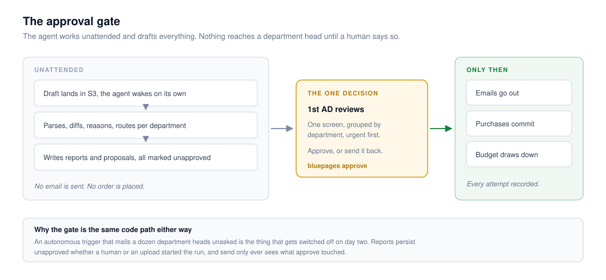

# Bluepages

**An agent that reads every new draft of a film script and tells each production
department what changed for them.**

A revised draft lands in the watched folder. The agent wakes on its own, parses
both drafts, works out what actually changed, reasons about what those changes
*mean*, and routes the consequences to each department in that department's own
vocabulary. The 1st Assistant Director reviews one screen and approves.
Notifications go out.

Built with the [Strands Agents SDK](https://strandsagents.com) on Amazon
Bedrock. MIT licensed.



---

## The problem

A shooting script is rewritten constantly during production, sometimes nightly.
Every revision silently invalidates the element lists that a dozen departments
work from: the props list, the wardrobe continuity, the picture vehicles, the
day-out-of-days.

Today a human does this. The 1st AD reads both drafts side by side and works out
the difference by hand. It is repetitive, it is judgment-heavy, and the timing
is brutal: revisions arrive after the shooting day wraps and are needed before
call time the next morning, so the work happens at night, tired, under time
pressure. Things get missed. A missed element means a department shows up
without the thing, and a shoot day costs tens of thousands of dollars.

This is exactly the shape of work worth handing to an agent. It recurs on a
schedule nobody controls, it is mechanical at the bottom and judgment at the
top, and the human's real contribution is the approval at the end, not the four
hours of comparison before it.

**Who it is for.** 1st ADs, script supervisors, and production coordinators on
scripted film and television.

## Why a diff is not enough

The mechanical diff is the easy part, and shipping it alone would be worse than
useless: a department head who gets a wall of string changes stops reading them.
The product is the judgment on top.



Structural diffing cannot tell you that a page of dialogue rewrites has no
physical consequence while four words in a scene heading just cost the
production a day. That distinction is the entire value, and it is the part a
model is genuinely good at.

## What the agent actually does

| | |
|---|---|
| **Wakes by itself** | An upload to the watched S3 prefix triggers a Lambda, which finds the previous draft on its own and starts the run. A first upload just records a baseline. |
| **Parses to a real model** | `.fdx` through `lxml` is the primary path: typed elements, stable scene numbers, native revision marks. PDF through `pdfplumber` is tier 2, driven by the positional layout screenplays use. |
| **Aligns on scene number** | Scene numbers are stable across drafts by industry convention, which is why cut scenes are marked `OMITTED` rather than deleted. |
| **Extracts elements** | A bulk-tier model reads each changed scene for props, cast, vehicles, wardrobe and clearance risks. |
| **Reasons about meaning** | A judgment-tier model takes each change with its scene text and decides what it means and who needs to know. |
| **Routes to 12 departments** | Props, wardrobe, transport, locations, cast, art, SFX, stunts, schedule, clearance, AD and social, each in its own vocabulary, in parallel. |
| **Checks its own hunches** | When the model notices a consequence in a neighbouring scene, that hunch is verified against the actual scene text before it survives as a finding. |
| **Sources and prices** | A new element implies an acquisition. The agent searches the live web for a real product with a supplier, a price, and the citations to click through. |
| **Does the budget arithmetic** | A proposal that would overrun a department's remaining line says so before you approve it, not after. |
| **Stops and asks** | Everything persists unapproved. The AD approves once, and only then does anything leave the building. |



**On what is simulated.** The agent is not connected to a vendor, a purchase
order system, or a payment rail, so it places no orders. Purchases are recorded
as proposals and rendered as proposals. The sourcing, the prices and the budget
arithmetic are real; the transaction is not, and nothing in the system claims
otherwise. A production office does not want a tool that quietly buys things. It
wants one that says "this revision costs Props $1,340 of their remaining
$4,000", and then waits.

## How Strands is used

Strands' `Agent` drives every model call in the system, and the project's cost
guards are built *into* that agent rather than sitting beside it:

- **`BedrockModel` carries `max_tokens`**, so no code path can omit it.
- **A `BeforeInvocationEvent` hook enforces the per-run call ceiling.** That
  event is used deliberately: `BeforeModelCallEvent` does not fire for
  `structured_output`, so hanging the ceiling there would leave structured calls
  unbounded, which is the exact failure the ceiling exists to prevent.
- **Agents are constructed per call, stateless, with no tools and no history.**
  Each call judges one scene on its own evidence. A reused agent would carry
  conversation history the next scene has no business seeing.
- **The disk cache and the fallback chain sit above the agent**, so a cache hit
  never constructs one and a throttled model is reclassified without the agent
  knowing.

Department fan-out is a thread pool rather than a Strands multi-agent primitive.
`Swarm` and `GraphBuilder` are for dependent hand-off work; department reports
are N independent, stateless rewrites of an already-routed finding. Strands
still drives each of those calls individually.

`trigger/agentcore.py` is a tested AgentCore Runtime entry point. Lambda is the
default deployment because the agent is dormant between revisions, and a
function that bills for the seconds it runs beats a runtime that bills for
idling.

## Requirements

- Python 3.12 or 3.13
- An AWS account with Bedrock model access enabled, for the semantic layer.
  Parsing and the mechanical diff run without it.

## Setup

```bash
# 1. Create the virtualenv
py -3.12 -m venv .venv          # Windows
python3.12 -m venv .venv        # macOS / Linux

# 2. Activate it
.venv\Scripts\activate          # Windows
source .venv/bin/activate       # macOS / Linux

# 3. Install
pip install -e ".[dev]"

# 4. Configure
cp .env.example .env            # then fill in .env

# 5. Verify everything is wired up
bluepages doctor
```

`bluepages doctor` checks your Python version, config, AWS credentials, Bedrock
model access and the fallback providers, and tells you exactly what to fix. It
ends by actually calling Bedrock, because "credentials resolve" and "the model
answers" are different things.

### Bedrock access

Model access is enabled per region and per model in the AWS console: **Bedrock →
Model access → Modify model access**. Run `bluepages models` to list the model
IDs that region actually offers, and put them in `.env`. Model IDs are config,
never hardcoded, so pointing at a different model or an inference-profile ARN is
an `.env` change.

## Usage

Parse a draft into the internal script model:

```bash
bluepages parse script.fdx                # .fdx, tier 1, the primary path
bluepages parse script.pdf                # PDF, tier 2, coordinate-driven
bluepages parse script.fdx --stats        # summary instead of full JSON
bluepages parse script.fdx -o out.json    # write it to a file
bluepages parse script.fdx -v             # show per-scene progress events
```

Diff two drafts. This is mechanical only and costs nothing:

```bash
bluepages diff old.fdx new.fdx
bluepages diff old.fdx new.fdx --key answer-key.json     # and score the result
```

Run the full pipeline, including the model passes. This costs money:

```bash
bluepages reason old.fdx new.fdx
bluepages reason old.fdx new.fdx --key answer-key.json   # score against ground truth
bluepages reason old.fdx new.fdx --no-elements           # skip extraction, fewer calls
bluepages reason old.fdx new.fdx --max-calls 20          # tighter ceiling for this run
bluepages reason old.fdx new.fdx --json findings.json    # write the findings out
```

Fan one revision out to every department, each in its own vocabulary:

```bash
bluepages fan-out old.fdx new.fdx
bluepages fan-out old.fdx new.fdx --department props     # one department only
bluepages fan-out old.fdx new.fdx --save --production "The Farm"
bluepages approve "The Farm"                             # the AD's decision point
bluepages send "The Farm"                                # only touches what approve released
```

Persist a run and query it back. `--save` writes to a local SQLite file unless
Supabase is configured:

```bash
bluepages reason old.fdx new.fdx --save --production "The Farm"
bluepages inventory "The Farm"                       # every element and where it appears
bluepages inventory "The Farm" --element "brass letter opener"   # one object's trail
bluepages report "The Farm"                          # findings routed per department
bluepages report "The Farm" --department props       # one department only
bluepages history "The Farm"                         # past runs and what they cost
bluepages recipients "The Farm"                      # who each department's mail goes to
bluepages watch                                      # follow a live run's events
```

Environment and test data:

```bash
bluepages doctor                          # check the environment
bluepages models                          # list the models Bedrock offers in your region
bluepages key tests/fixtures/small-answer-key.json   # show and validate an answer key
```

### Try it without an AWS account

The repo ships a hand-authored revision pair and a labelled answer key. The
mechanical diff makes no model calls:

```bash
bluepages diff tests/fixtures/small-draft-1.fdx tests/fixtures/small-draft-2.fdx \
  --key tests/fixtures/small-answer-key.json
```

## Web app

`frontend/` is a Vite + React + TypeScript app over the FastAPI backend, talking
REST for state and SSE for live runs: draft upload, the run console as it
happens, scene and element inventory, the revision view with its approval gate,
per-department inboxes, the decision log and the budget view.

```bash
# Terminal 1: the API
uvicorn bluepages.api.app:app --reload

# Terminal 2: the frontend
cd frontend
npm install
npm run dev       # http://localhost:5173, proxies /api to :8000
```

Nothing here needs AWS to run: point the frontend at a local `uvicorn` process
backed by local SQLite and every screen works. `npm run build` produces static
files in `frontend/dist` for any static host, and the API is a normal ASGI app.

The live run view is a consumer of the pipeline's own progress events, not a
parallel tracking system that can drift from what actually happened. The CLI
prints those same events; the API forwards the identical stream over SSE.

## Correctness

No public corpus of the same script at draft N and N+1 exists, so the revision
pairs are authored here, by hand, along with a labelled answer key. The key
records exactly what changed, which department each change belongs to, and a
`must_not_say` list per change: the specific wrong conclusions that would be
expensive in production.

That key is the correctness measure. Semantic output with no ground truth to
check it against is not verified, so `--key` scores three things separately:

- **recall**, whether each labelled change was found at all
- **judgment**, whether it reached the right conclusion about the change
- **forbidden phrases**, whether it said something the key rules out

```bash
pytest                    # 544 tests; the paid ones are deselected
pytest -m live            # the semantic layer against real Bedrock. Costs money.
ruff check src tests scripts
mypy
```

The `live` suite is the only one that measures model judgment. It skips when AWS
is not configured.

### Cost at scale

Extraction and reasoning both scope to the scenes a revision actually touches,
not to every scene in the script. Cost tracks the size of the revision, not the
size of the script:

| | small pair | feature-length pair |
|---|---|---|
| scenes | 9 | 120 → 121 |
| scenes changed | 6 | 4 |
| model calls | ~8 | 11 |
| tokens | ~9,000 | 11,999 |
| cost | ~$0.04 | ~$0.06 |
| wall clock | a few seconds | 31s |
| answer key | 8/8, 0 forbidden | 8/8, 0 forbidden |

The feature-length row is a single measured run, reproduced by
`pytest -m live tests/live/test_feature_scale.py -s`, which asserts the call
count directly rather than leaving it as a claim: a regression that stops
scoping extraction to the changed scenes fails this test before it fails the
AWS bill.

## Cost safety

AWS has no hard spending cap and billing lags hours, so the guards are
architectural rather than reactive:

- No LLM call sits in an unbounded loop
- `max_tokens` is always set; there is no code path that omits it
- Every run has a call ceiling that raises rather than continuing
- Web searches are capped per run and cached by element name
- Responses are cached on disk during iteration, so re-running an unchanged pair
  is free
- Development runs against the small test pair, not a feature-length script

The model fallback chain is for resilience, not economy: Bedrock throttles under
parallel load. It triggers on throttling, timeouts and 5xx only, never on schema
or prompt errors, which fail identically on every provider and would otherwise
burn three quotas on one bug. Which model answered is always logged, because
fallback output is weaker and that should be visible rather than silent.

## Layout

```
src/bluepages/
  config.py      Settings, loaded from env
  model/         The internal script model, the shared contract
  parse/         Parser tiers: .fdx (1), PDF (2)
  diff/          Scene alignment and the mechanical diff
  semantic/      Element extraction, reasoning, ripple checks, scoring
  agents/        Department fan-out, clearance, schedule, sourcing, budget, decisions
  pipeline/      The end to end run, shared by CLI, API and trigger
  store/         The element database: schema, connection, identity across drafts
  llm/           Strands agent construction, Bedrock client, structured output, fallback
  events/        Structured progress events, consumed by the CLI and the SSE stream
  deliver/       Department email rendering and sending
  trigger/       S3 to Lambda entry point, plus the AgentCore Runtime hedge
  api/           FastAPI REST + SSE
frontend/        Vite + React + TS web app
docs/diagrams/   Architecture diagrams
tests/           544 unit tests, plus the live suite that costs money
```

See [ARCHITECTURE.md](ARCHITECTURE.md) for how the pieces fit together and why
the shape is this shape.

## License

MIT. See [LICENSE](LICENSE).
